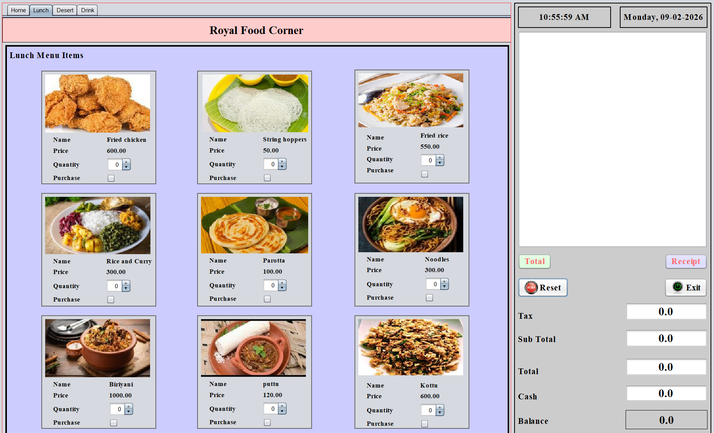
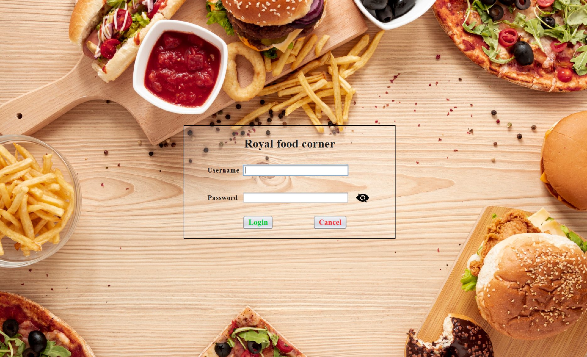

# Royal Food Corner - Restaurant Management System

Welcome to the Royal Food Corner management system! This is a Java Swing application designed to manage restaurant orders, calculate bills, and generate receipts.

> [!NOTE] 
> This project was developed as a campus assignment for the **Programming Module** of the **HND in Software Engineering**.

## 📸 Screenshots


*Login Screen*


*Dashboard View*


*Menu Selection and Billing*

## ✨ Features

*   **User Authentication**: Secure login system (Default credentials provided below).
*   **Menu Management**: Categorized menu items including Lunch, Dinner, Drinks, and Desserts.
*   **Order Processing**: clear interface to select items and adjust quantities.
*   **Billing System**: Automatic calculation of Subtotal, Tax, and Grand Total.
*   **Receipt Generation**: Ability to verify orders and generate receipts.
*   **Reset & Exit**: Easy controls to clear current selections or exit the application.

## 🚀 How to Run

1.  **Prerequisites**: Ensure you have Java Development Kit (JDK) installed.
2.  **Clone/Download**: Download this project to your local machine.
3.  **Compile**: 
    Navigate to the `src` directory and compile the java files.
    ```bash
    javac loginpage.java
    ```
4.  **Run**:
    Execute the main class:
    ```bash
    java loginpage
    ```
    *Note: You may need to set up the project in an IDE like NetBeans or Eclipse for easier management of dependencies and build processes.*

## 🔐 Default Credentials

To access the system, use the following login details:

*   **Username**: `admin`
*   **Password**: `admin`

## 🛠️ Technology Stack

*   **Language**: Java
*   **GUI Framework**: Swing (JFrame)
*   **IDE Used**: NetBeans (suggested based on project structure)

---
*Developed by [D_I_N_U]*
